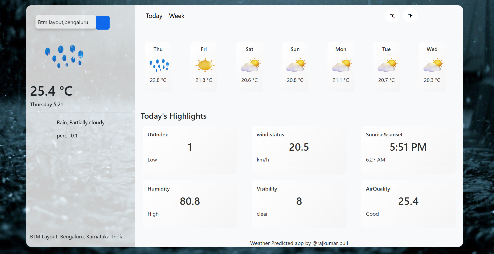

# 🌦️ Weather Prediction App

A React-based weather dashboard that fetches real-time data from the **Visual Crossing Weather API**.  
It provides users with **current conditions, hourly forecasts, and daily highlights** such as UV Index, Wind Status, Sunrise & Sunset, Humidity, Visibility, and Air Quality.

---


## 🚀 Live Demo
Check out the deployed app here: [Weather Prediction App](https://weather-prediction-tau.vercel.app/)

---

## 🚀 Features
- 🔍 **City Search**: Enter any city to get live weather data.  
- 🕒 **Current Time & Day**: Auto-updates every second using React Context.  
- 🌤️ **Hourly Forecast**: Displays temperature, icons, and time in 12-hour format.  
- 📊 **Daily Highlights**:  
  - UV Index with interpretation (Low, Moderate, High, etc.)  
  - Wind speed and status  
  - Sunrise & Sunset times  
  - Humidity levels
  - Visibility (Poor, Moderate, Clear)  
  - Air Quality (Good, Moderate, Unhealthy, etc.)  
- 🎨 **Dynamic Backgrounds & Icons**: Weather conditions mapped to custom icons and backgrounds.  
- 📱 **Responsive Design**: Built with Bootstrap for mobile and desktop layouts.

---

## 🛠️ Tech Stack
- **React** (Hooks, Context API)  
- **Axios** (API calls)  
- **Bootstrap** (responsive UI)  
- **React Router** (navigation between Today & Week views)  
- **Visual Crossing Weather API** (data source)

---

## 📦 Installation

1. Clone the repository:
   ```bash
   git clone https://github.com/Rajafrom26/Weather-Prediction.git
   cd weather-app
   ```

2. Install dependencies:
   ```bash
   npm install
   ```

3. Start the development server:
   ```bash
   npm run dev
   ```

---

## 🔑 Configuration
- Get your free API key from [Visual Crossing](https://www.visualcrossing.com/weather-api).  
- Replace the API key in `PredictionComp.js`:
  ```js
  const { data } = await axios.get(
    `https://weather.visualcrossing.com/VisualCrossingWebServices/rest/services/timeline/${city}?unitGroup=metric&key=YOUR_API_KEY&contentType=json`
  );
  ```

---

## 📸 Screenshots
- **Dashboard View**: 
- **Hourly Forecast**: 

---

## 🤝 Contributing
Pull requests are welcome! For major changes, please open an issue first to discuss what you’d like to change.

---

## 📜 License
This project is licensed under the MIT License.

---
